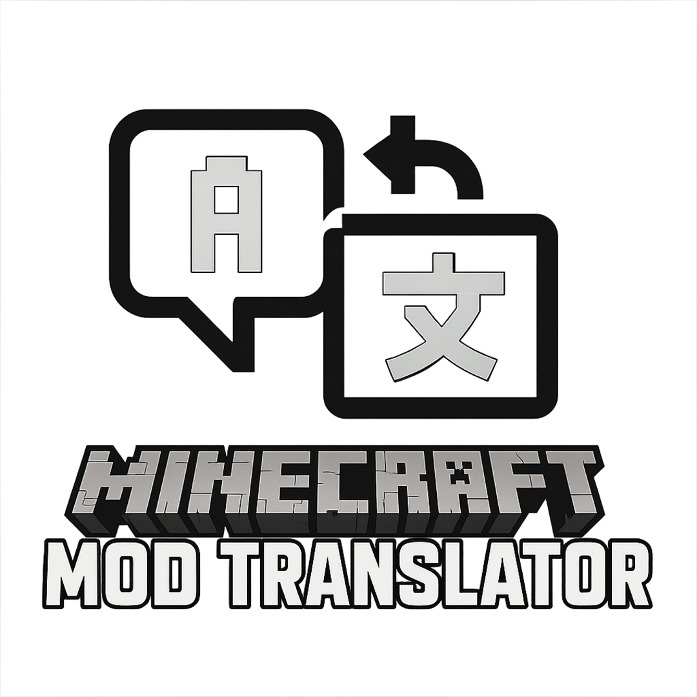
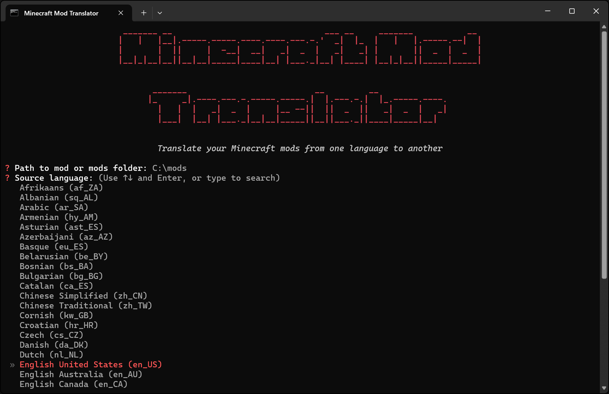
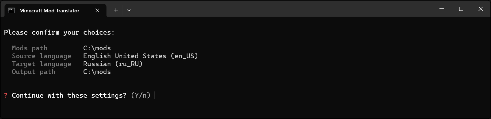
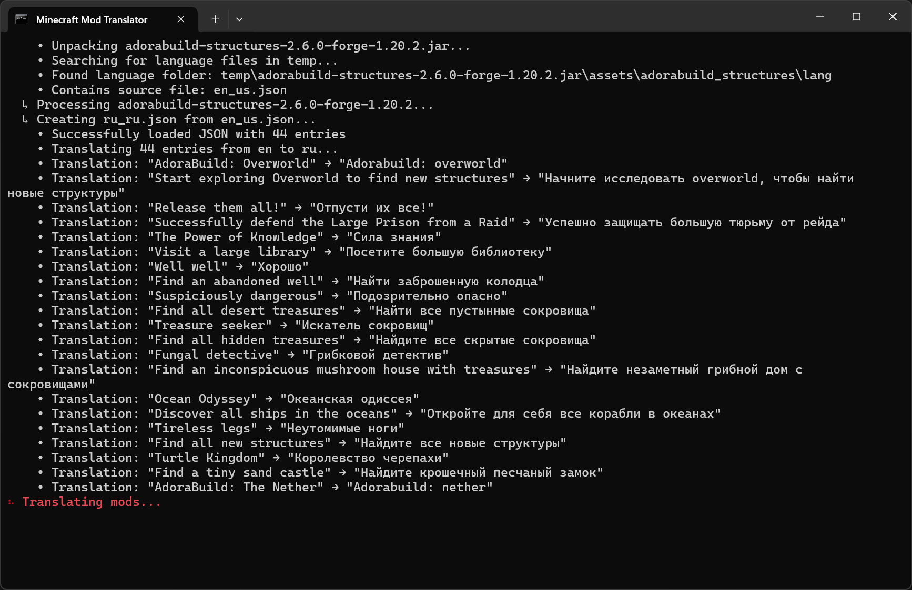
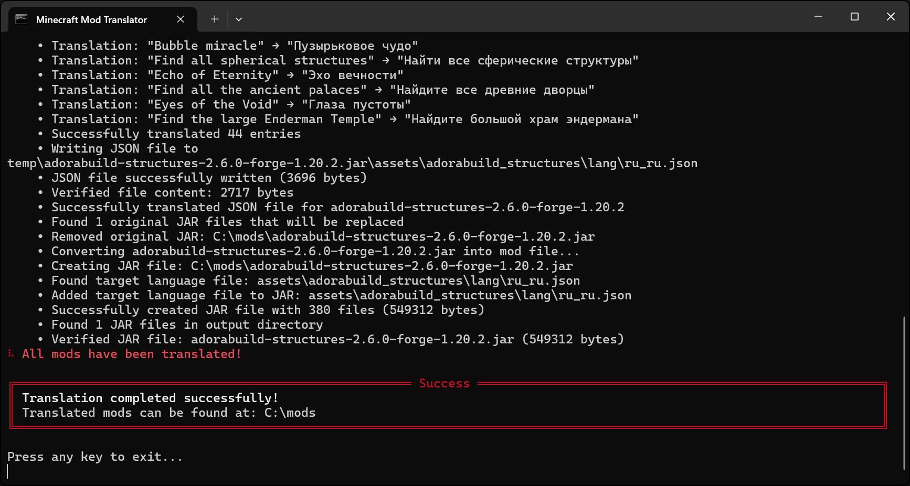

<div align="center">
  
</div>

# ⛏️ Minecraft Mod Translator

A powerful tool for translating Minecraft mods into multiple languages, automating the localization process for mod developers and translators.

> After searching extensively for an automatic translator for Minecraft mods without success, I developed this solution to address this need. While there is room for improvement, it effectively serves its purpose of making mods accessible across language barriers.

## 🚀 Features

- **Automated Translation**: Quickly translate mod files to multiple languages
- **AI-Powered Translation**: Optional OpenAI integration for higher quality translations  
- **JSON & LANG Support**: Compatible with Minecraft's localization file formats
- **Multiple Translation Services**: Support for Google Translate (free) and OpenAI (API key required)
- **Batch Processing**: Translate single files or entire mod folders at once

## 🛠️ Installation

### Option 1: Pre-built Executables (Easiest)

Download ready-to-use executable files from the [Releases Page](https://github.com/zvictorium/minecraft-mod-translator/releases):

- **App Version**: Download `Minecraft Mod Translator.exe` (Interactive application)
- **CLI Version**: Download `mod-translator.exe` (Command-line interface)

Simply download and run - no Python installation required!

### Option 2: From Source (For Developers)

```bash
# Clone or download the project
git clone https://github.com/zvictorium/minecraft-mod-translator.git
cd minecraft-mod-translator

# Setup the environment (Windows)
setup.bat
# Or for Linux/Mac
./setup.sh

# For AI translation support, install additional dependencies:
pip install openai python-dotenv
# Or install everything with:
pip install -e .[ai]

# Run the application (Windows)
start.bat
# Or for Linux/Mac
./start.sh
```

## 🎯 Usage

### Interactive Mode (Recommended)

```bash
mod-translator app
```

### Command Line Interface

```bash
# Basic usage with Google Translate (free)
mod-translator --path path/to/mods --source en_US --target es_ES --output path/to/output

# AI-powered translation with OpenAI (requires API key)
mod-translator --path path/to/mods --source en_US --target es_ES --output path/to/output --ai

# Parameters:
# --path (-p): Path to mod or mods folder (default: ./mods)
# --source (-s): Source language code (e.g., en_US)
# --target (-t): Target language code (e.g., es_ES)
# --output (-o): Output folder path (if same as mods path, will replace original mods)
# --ai: Use OpenAI translation instead of Google Translate (requires OPENAI_API_KEY)
```

### 🤖 AI Translation Setup

To use OpenAI-powered translation for higher quality results:

1. **Get an OpenAI API key**: Visit [OpenAI API](https://platform.openai.com/api-keys)
2. **Set up environment**: Create a `.env` file in the project root:
   ```
   OPENAI_API_KEY=your_api_key_here
   OPENAI_MODEL=gpt-3.5-turbo
   ```
3. **Install dependencies**: 
   ```bash
   pip install openai python-dotenv
   ```
4. **Use the --ai flag** when running translations

> **Note**: OpenAI translation provides better context awareness and gaming-specific terminology but requires an API key with usage costs.

## 📸 Screenshots

### Main Application


### Confirmation


### Translation Process


### Results View


## 📄 License

This project is licensed under the [**Creative Commons Attribution-NonCommercial 4.0 International License (CC BY-NC 4.0)**](LICENSE).

## 🙋 Support

- **🐙 Repository**: [https://github.com/zvictorium/minecraft-mod-translator](https://github.com/zvictorium/minecraft-mod-translator)
- **📋 Issues**: [Report bugs or request features](https://github.com/zvictorium/minecraft-mod-translator/issues)
- **📦 Releases**: [Download latest version](https://github.com/zvictorium/minecraft-mod-translator/releases)

---

**Made with ❤️ for Minecraft modders and the community**

[](https://www.buymeacoffee.com/victorium)
